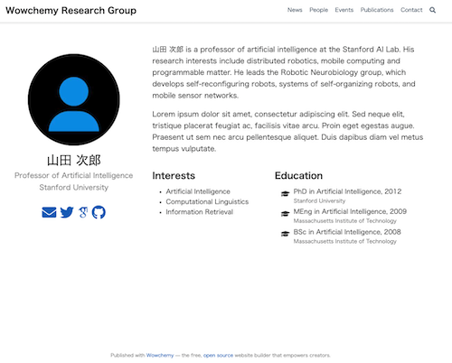
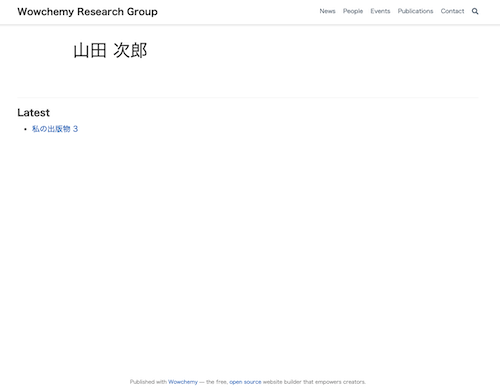
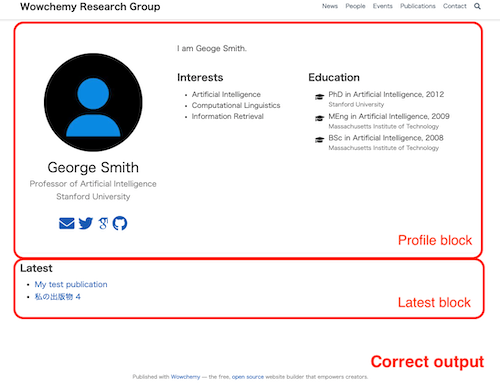

# In wowchemy theme, author pages randomly produced that include Japanese title.

[Discussion in wowchemy repository](https://github.com/wowchemy/wowchemy-hugo-modules/discussions/2360#discussion-3436100)

# How to

1. Execute `hugo server`.
2. Access `localhost:1313` .
3. Select "People" menu.
4. Select "山田 次郎".
5. Open `content/authors/yamada-jiro/_index.md` in your editor.
6. Add any changes in the file and save it (if you use vscode, `Ctrl + S` without any changes).
7. Hot reload author page.
8. Repeat step 6.
9. You can see that the page sometimes changes.

George Smith's page shows his profile and Latest, which is the ideal output.
In 山田 次郎's page, one of them appears to be displayed randomly.

## Japanese name author's page

Randomly selected from two

## English name author's page

It is a correct output.